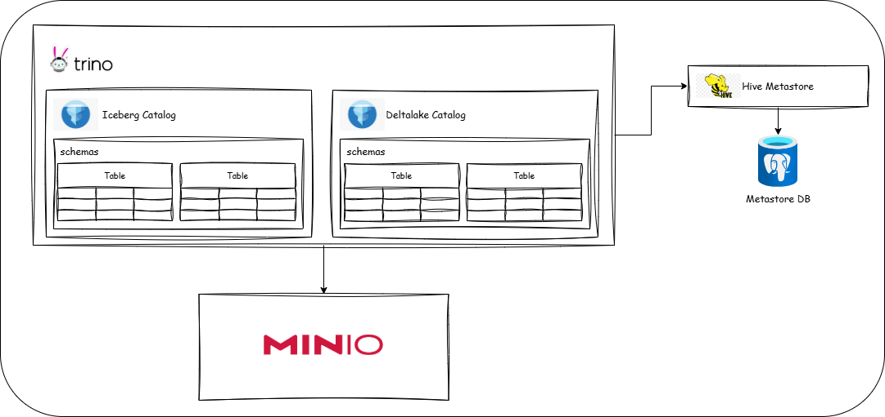
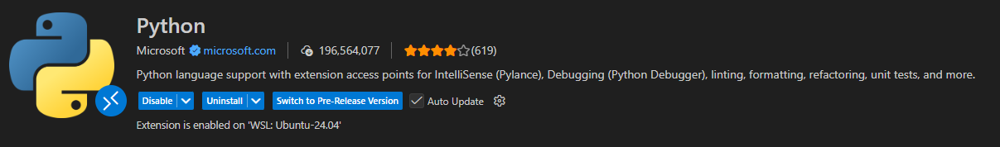
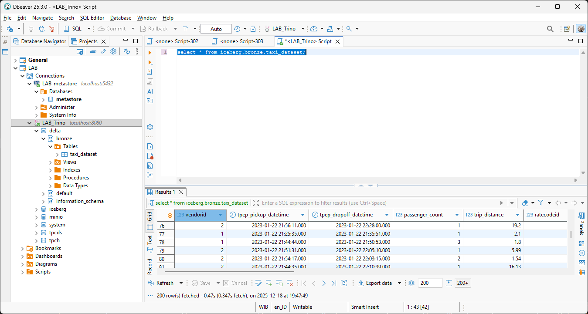
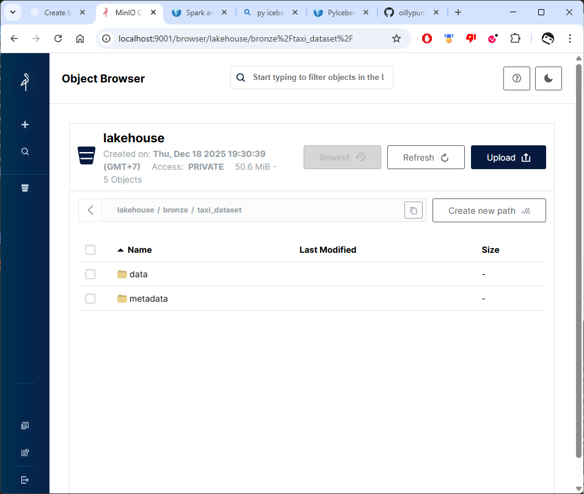
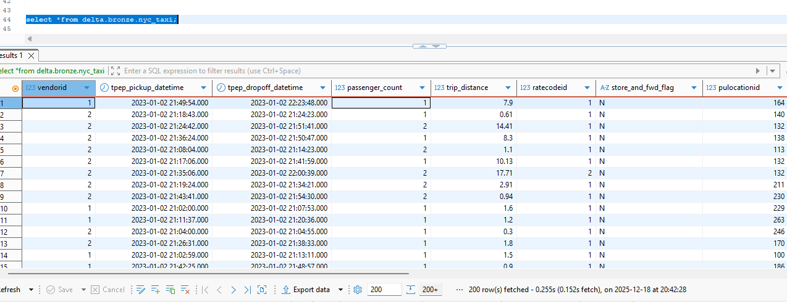
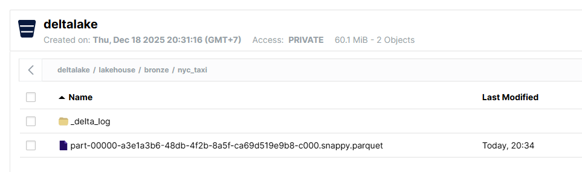

# ODP Lab

## Logical topology



### clone repo
```
$ git clone https://github.com/oillypump/odp_lab.git
```

### update host
```
$ cd odp_lab
$ chmod +x update_host.sh
$ sudo sh update_host.sh
```

### install python + notebook extension

<!-- 
 -->

### create python env

```
$ python3 -m venv .venv
$ pip install -r requirements.txt
```
### build image and start docker container

```
$ docker compose up -d
```

## load parquet to ICEBERG
### download dan load data ``yellow_tripdata_2023-01.parquet`` to Iceberg 

open and run jupyter notebook : /notebook/load-to-iceberg.ipynb

### check loaded table on trino & minio

- trino 



- minio 



## load parquet to DELTALAKE
### download dan load data ``yellow_tripdata_2023-01.parquet`` to deltalake 

open and run jupyter notebook : /notebook/load-to-deltalake.ipynb

### register table on trino
```
CALL delta.system.register_table(
  schema_name => 'bronze',
  table_name  => 'nyc_taxi',
  table_location => 's3a://deltalake/lakehouse/bronze/nyc_taxi'
);

```

### check loaded table on trino & minio

- trino



- minio


