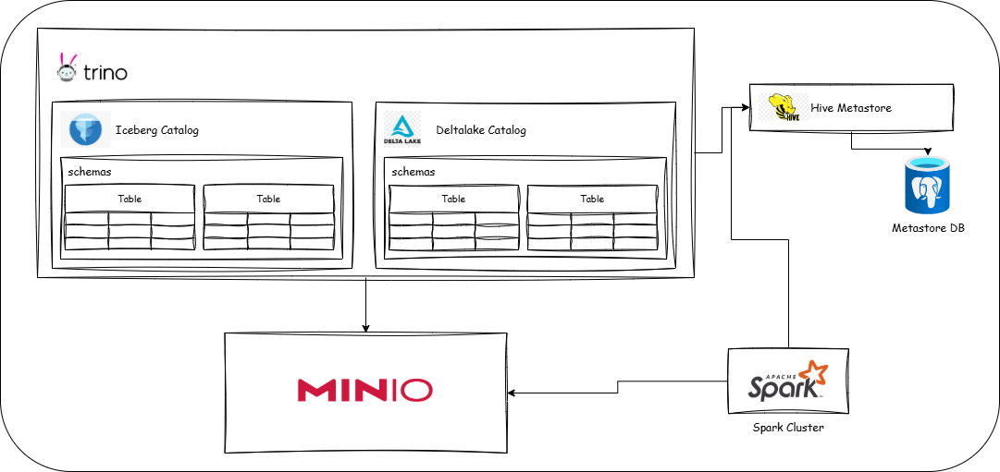

# ODP Lab

## Logical topology

<!--  -->



### clone repo

```
$ git clone https://github.com/oillypump/odp_lab.git
```

### update host

```
$ cd odp_lab
$ chmod +x update-host.sh
$ sudo sh update-host.sh
```

### install python + notebook extension

<!-- 
 -->

### create python env

```
$ python3 -m venv .venv
$ pip install -r requirements.txt
```

### build image and start docker container

```
$ docker compose up -d
```

## load parquet to ICEBERG

### download dan load data `yellow_tripdata_2023-01.parquet` to Iceberg

open and run jupyter notebook : /notebook/load-to-iceberg.ipynb

### check loaded table on trino & minio

- trino


- minio


## load parquet to DELTALAKE

### download dan load data `yellow_tripdata_2023-01.parquet` to deltalake

open and run jupyter notebook : /notebook/load-to-deltalake.ipynb

### register table on trino

```
CALL delta.system.register_table(
  schema_name => 'bronze',
  table_name  => 'nyc_taxi',
  table_location => 's3a://deltalake/lakehouse/bronze/nyc_taxi'
);

```

### check loaded table on trino & minio

- trino


- minio


## SPARK : Load data to Iceberg

open and run spark-load-to-iceberg.ipynb dari web jupyter

- notebook
  

- spark master
  

- spark worker
  

- trino
  

## SPARK : read data from Iceberg

open and run spark-read-from-iceberg.ipynb dari web jupyter

- notebook
  

- spark master
  

- spark worker
  

- spark histo
  

## Refference

https://www.youtube.com/watch?v=GGdVfDdeNYs

## command

docker compose build --no-cache && docker compose up -d
